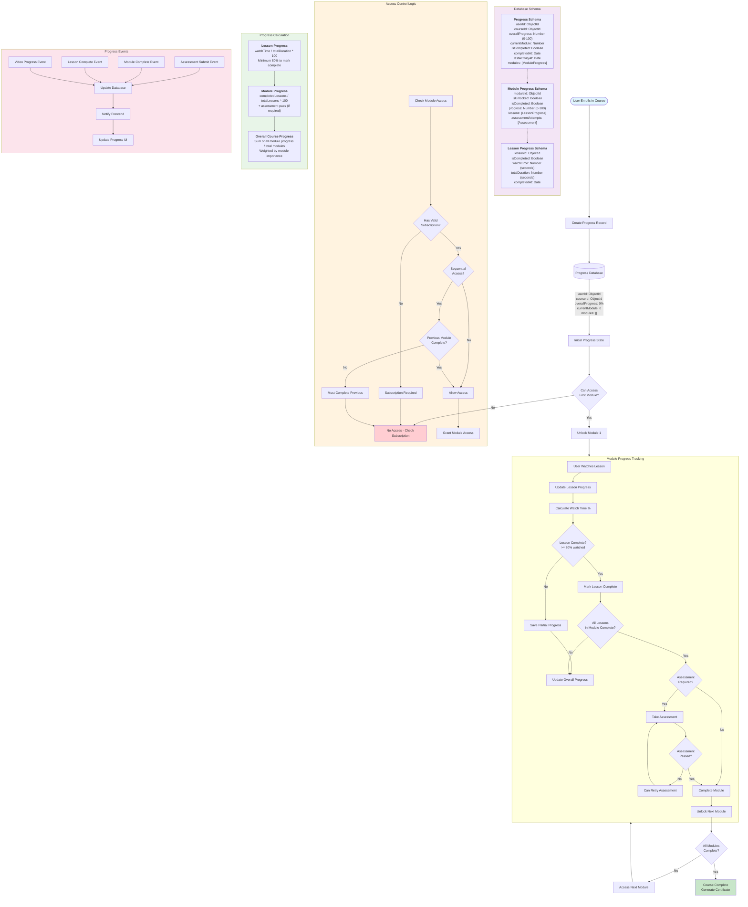

# Course Progress Tracking System

This document explains how the course progress tracking works in the TechyJaunt Learning Platform.



## Key Features:

### 1. **Sequential Module Unlocking**
- Users must complete modules in order
- Next module unlocks only after current module completion
- Prevents skipping ahead without learning foundations

### 2. **Lesson Progress Tracking**
- Tracks video watch time in real-time
- Calculates completion percentage (watchTime/totalDuration)
- Requires minimum 80% watch time to mark lesson complete

### 3. **Assessment Integration**
- Modules can have required assessments
- Must pass assessment to complete module
- Multiple attempts allowed with configurable limits
- Handles timeout submissions gracefully

### 4. **Subscription-Based Access**
- Validates subscription before allowing module access
- Different subscription tiers may have different access levels
- Prevents unauthorized access to premium content

### 5. **Real-time Progress Updates**
- Frontend receives real-time progress updates
- Database tracks last activity timestamp
- Progress persists across sessions

### 6. **Flexible Progress Calculation**
```javascript
// Lesson Progress
lessonProgress = (watchTime / totalDuration) * 100

// Module Progress  
moduleProgress = (completedLessons / totalLessons) * 100

// Overall Course Progress
overallProgress = sumOfModuleProgress / totalModules
```

### 7. **Certificate Generation**
- Automatic certificate generation upon course completion
- Tracks completion date and time
- Can be downloaded or shared

This system ensures structured learning while providing flexibility for different learning styles and paces.
